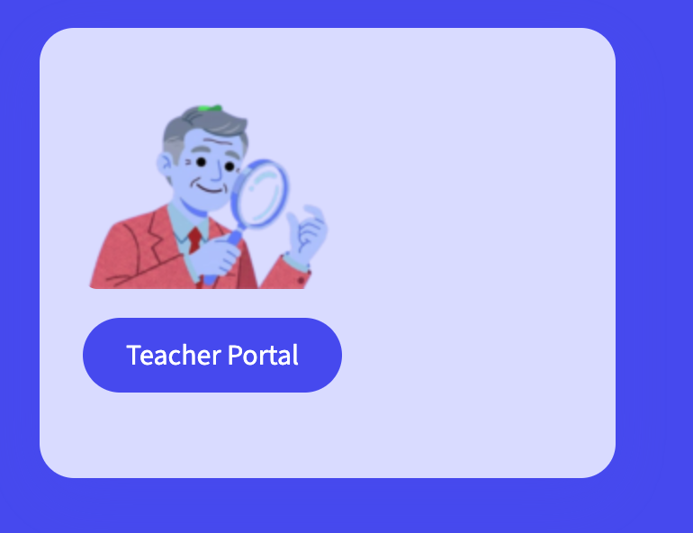
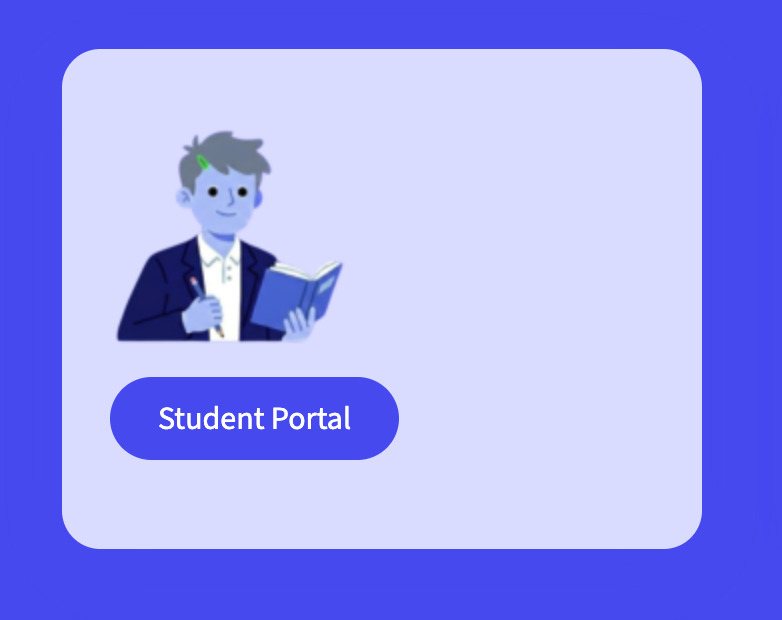
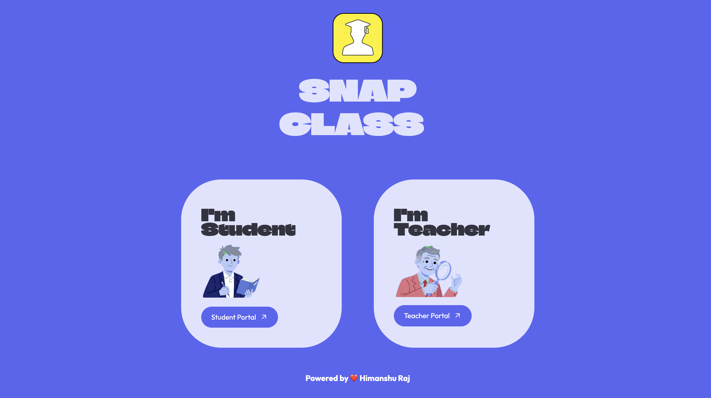

# 🎨 SnapClass — Landing Page

> **The official landing page for SnapClass — an AI-powered attendance system using Facial Recognition + Voice Recognition.**

This repository contains the **public-facing marketing and product landing page** for SnapClass.

The landing page introduces the product, highlights its capabilities, showcases the application through screenshots, and provides a direct entry point to the live SnapClass application.

The complete attendance application is maintained separately in the [`snapclass`](https://github.com/Himanshu1425/snapclass) repository.

---

## 🚀 Live Project

| Resource                           | Link                                                                                                        |
| ---------------------------------- | ----------------------------------------------------------------------------------------------------------- |
| 🌐 **Landing Page**                | [Open SnapClass Landing Page](https://ai-attendance-project-landing-alpha.vercel.app/)                      |
| 🤖 **Live Application**            | [Launch SnapClass](https://snapclass-wjyzofaajafvxeegufx6ch.streamlit.app/)                                 |
| 💻 **Main Application Repository** | [Himanshu1425/snapclass](https://github.com/Himanshu1425/snapclass)                                         |
| 📦 **Landing Page Repository**     | [Himanshu1425/ai-attendance-project-landing](https://github.com/Himanshu1425/ai-attendance-project-landing) |

---

## ✨ What is SnapClass?

SnapClass is designed to modernize classroom attendance using AI-powered identification.

Instead of manually calling student names, teachers can use:

📸 **Facial Recognition**
Identify enrolled students from classroom photographs.

🎙️ **Voice Recognition**
Record short voice clips and match students using speaker embeddings.

👨‍🎓 **FaceID Student Login**
Students can register and return using facial recognition.

📊 **Attendance Management**
Teachers can review attendance and access stored attendance records.

🔗 **Easy Subject Enrollment**
Students can join subjects using codes or shareable links.

---

## 🖼️ Product Preview

### Teacher Experience



### Student Experience



### Landing Page



---

## 🎯 Key Highlights

* ⚡ AI-assisted classroom attendance
* 📸 Photo-based facial recognition
* 🎙️ Voice-based speaker recognition
* 👤 FaceID-based student authentication
* 🔐 Secure teacher authentication
* 📚 Subject and enrollment management
* 📊 Attendance history and records
* ☁️ Cloud-deployed architecture
* 📱 Responsive product landing page

---

## 🛠️ Technology Stack

| Layer                | Technology               |
| -------------------- | ------------------------ |
| **Backend**          | Flask                    |
| **Frontend**         | HTML5, CSS3, JavaScript  |
| **Templating**       | Jinja2                   |
| **Deployment**       | Vercel                   |
| **Version Control**  | Git, GitHub              |
| **Main Application** | Streamlit                |
| **Database**         | Supabase / PostgreSQL    |
| **AI/ML**            | Face & Voice Recognition |

---

## 🏗️ Project Architecture

The project is intentionally separated into **two deployable applications**:

```text
                    ┌──────────────────────────┐
                    │   SnapClass Landing      │
                    │       Flask + Vercel     │
                    └────────────┬─────────────┘
                                 │
                                 │ Launch SnapClass
                                 ▼
                    ┌──────────────────────────┐
                    │    SnapClass Application │
                    │     Streamlit Cloud      │
                    └────────────┬─────────────┘
                                 │
                    ┌────────────┴────────────┐
                    │                         │
             Face Recognition         Voice Recognition
                    │                         │
                    └────────────┬────────────┘
                                 │
                         Supabase / PostgreSQL
```

### Why separate repositories?

Keeping the landing page and application separate provides:

* Independent deployment
* Cleaner project organization
* Faster landing-page updates
* Separate frontend/product presentation layer
* Independent application development
* Clear separation between marketing UI and core AI application

---

## 📂 Project Structure

```text
ai-attendance-project-landing/
│
├── app.py                         # Flask application entry point
├── requirements.txt               # Python dependencies
├── vercel.json                    # Vercel configuration
│
├── static/
│   ├── css/
│   │   └── style.css              # Main stylesheet
│   │
│   ├── js/
│   │   └── script.js              # Frontend interactions
│   │
│   ├── fonts/
│   │   └── chison.ttf             # Custom font
│   │
│   └── img/
│       ├── logo.png
│       ├── app_logo.png
│       ├── apna_college.png
│       ├── apnacollege.png
│       └── demo/
│           └── Product screenshots
│
└── templates/
    └── index.html                  # Main landing page
```

---

## ☁️ Deployment Architecture

The landing page is deployed using **Vercel** and connected directly to the GitHub repository.

```text
Local Development
       ↓
     Git
       ↓
    GitHub
       ↓
      Vercel
       ↓
Live Landing Page
       ↓
Launch SnapClass
       ↓
Streamlit Application
```

### Continuous Deployment

The GitHub repository is connected to Vercel.

When changes are pushed to the `main` branch:

```text
Git Push
   ↓
Vercel detects change
   ↓
New deployment
   ↓
Updated landing page
```

---

## 💻 Run Locally

### 1. Clone the repository

```bash
git clone https://github.com/Himanshu1425/ai-attendance-project-landing.git
cd ai-attendance-project-landing
```

### 2. Create a virtual environment

```bash
python3 -m venv venv
source venv/bin/activate
```

### 3. Install dependencies

```bash
pip install -r requirements.txt
```

### 4. Start Flask

```bash
python3 app.py
```

The landing page will be available at:

```text
http://localhost:5002
```

---

## 🔗 Related Project

The landing page is only the presentation layer.

For the complete AI attendance implementation, visit:

👉 [**SnapClass — AI Attendance System**](https://github.com/Himanshu1425/snapclass)

The main repository contains:

* Facial recognition pipeline
* Voice recognition pipeline
* Teacher dashboard
* Student dashboard
* Subject management
* Attendance processing
* Supabase database integration
* Authentication system

---

## 👤 Author

### Himanshu Raj

Final-year Computer Science Engineering student focused on **Software Engineering, AI/ML, and Generative AI**.

* GitHub: [Himanshu1425](https://github.com/Himanshu1425)
* LinkedIn: [Connect with Himanshu](https://www.linkedin.com/)

---

## ⭐ Project

**SnapClass — AI-Powered Attendance System**

> From product landing page to AI-powered attendance processing, SnapClass is built as an end-to-end deployable application.

⭐ If you find the project interesting, consider starring the repositories on GitHub.

